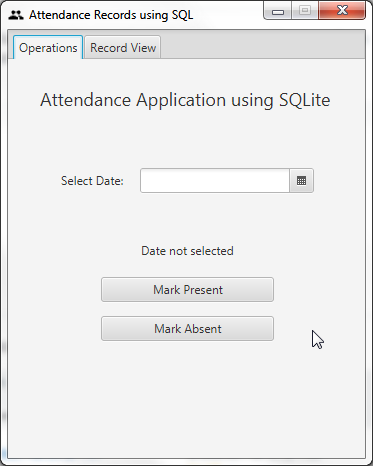

# Attendance DB using Sqlite3

## Description

This is a simple demonstration of SQLite3, using the Sqlite3 JDBC Driver, used as a project for the Databases class in my college. It uses Sqlite3 as a database, and the GUI provides a means for the user to perform insertion, and view the database.

## Screenshot

## Usage

__The JAR file can be found [here](https://github.com/roshanrahman/javafx-projects/raw/master/attendance-app-using-sqlite3/out/artifacts/attendancedb_jar/attendancedb.jar)__

1. Select the date
2. Click on "Mark Present" to insert the date into the database as "PRESENT"
 _(or)_ Click on "Mark Absent" to insert the date into the database as "ABSENT"

> If the date is already found in the database, it will be updated with the latest information.

