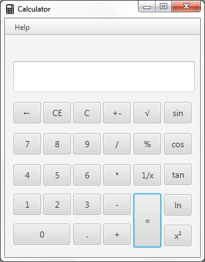

# Calculator (simple Windows Calculator clone)

## Description

This is a simple Calculator made in JavaFX designed to resemble the interface of the default Windows Calculator.

Uses EvalEx Java library (https://github.com/uklimaschewski/EvalEx)

## Screenshot

## Usage

__The JAR file can be found [here](https://github.com/roshanrahman/javafx-projects/raw/master/calculator/out/artifacts/calculator_jar/calculator.jar)__

